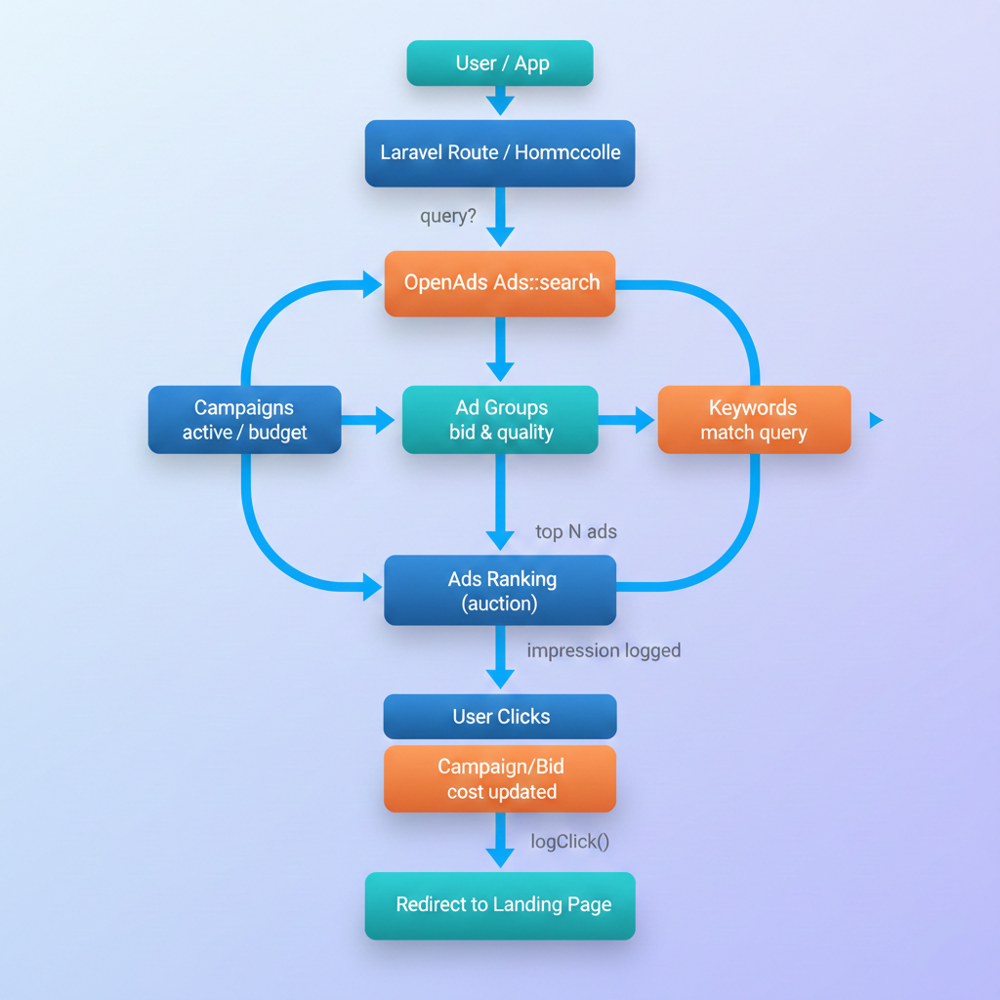

# OpenAds <a href="./README-ID.md">ID</a>

Lightweight & extensible OpenAds for Laravel, suitable for internal ads, marketplaces, CMS, or monetization platforms. All metrics (CTR, relevance, landing score) and click/view costs are automatically calculated based on ad performance.

---

## ✨ Key Features

- 🔍 Search Ads (keyword-based)
- 🖼️ Image & 🎥 Video Ads (URL / local / CDN)
- 🎯 Campaign → Ad Group → Ads → Keywords → Assets
- ⏰ Display based on time (start_time & end_time, default 24 hours)
- 🌍 Target locations: country / city (multi, default all)
- 📱 Target devices: android / ios / desktop (multi, default all)
- 🏆 Auction & ranking (bid × quality score)
- 📊 Automatic impression & click tracking
- 💰 Click cost = bid, view cost = bid × 20% (configurable)
- 🔄 CTR, relevance, landing score & campaign balance calculated automatically

---

## 📦 Installation

```bash
composer require lazyexe/openads
```

Or Manual / Local Development

```
"require": {
	"lazyexe/openads": "*"
},
"repositories": [
	{
		"type": "path",
		"url": "OpenAds"
	}
],
```

Publish config & migrations:

```bash
php artisan vendor:publish --tag=ads-config
php artisan vendor:publish --tag=ads-migrations
php artisan migrate
```

---

## 🚀 Usage

### Routes

```php
<?php

use Illuminate\Support\Facades\Route;
use App\Http\Controllers\HomeController;
use App\Http\Controllers\AdsClickController;

Route::get('/', [HomeController::class, 'index']);
Route::get('/ads/click/{adId}', [AdsClickController::class, 'click'])->name('ads.click');
```

### HomeController

```php
<?php

namespace App\Http\Controllers;

use Illuminate\Http\Request;
use OpenAds\Facades\Ads;

class HomeController extends Controller
{
    public function index(Request $request)
    {
        $query = $request->get('q', '');

        $adsCollection = $query ? Ads::search($query)->limit(3) : collect();

        return view('index', [
            'ads' => $adsCollection,
            'query' => $query,
        ]);
    }
}
```

### AdsClickController

```php
<?php

namespace App\Http\Controllers;

use Illuminate\Http\Request;
use OpenAds\Facades\Ads;

class AdsClickController extends Controller
{
    public function click(Request $request, int $adId)
    {
        $url = Ads::logClick($adId);
        if (!$url) {
            abort(404, 'Ads not found or insufficient budget.');
        }
        return redirect()->away($url);
    }
}
```

### index.blade

```blade
@if($ads->all())
    @foreach($ads->all() as $ad)
        <div>
            <div>Sponsored</div>
            <h4>{{ $ad->title }}</h4>
            @if(!empty($ad->assets))
                @php $asset = $ad->assets[0]; @endphp
                @if($asset->type === 'image')
                    source }}" alt="">
                @elseif($asset->type === 'video')
                    <video controls width="300">
                        <source src="{{ $asset->source }}">
                    </video>
                @endif
            @endif
            <p>
                <a href="{{ route('ads.click', $ad->id) }}" target="_blank">
                    {{ $ad->url }}
                </a>
            </p>
        </div>
    @endforeach
@else
    <p>No ads available.</p>
@endif
```

---

## 🔧 API Reference

| Method                        | Description                                                                   | Return             |                     |
| ----------------------------- | ----------------------------------------------------------------------------- | ------------------ | ------------------- |
| `Ads::search(string $query)`  | Retrieve ads by keyword query, automatically logs impressions & charges views | `AdCollection`     |                     |
| `AdCollection->all()`         | Get all ads                                                                   | `array` of `AdDTO` |                     |
| `AdCollection->limit(int $n)` | Get top n ads by score                                                        | `AdCollection`     |                     |
| `Ads::logClick(int $adId)`    | Log click & charge campaign according to bid                                  | `string            | null` (landing URL) |

---

## ⚙️ Configuration

`config/ads.php`

```php
return [
    'default_platform' => 'search',
    'view_cost_percent' => 0.2, // view cost = bid * 20%
];
```

#### 💡 Notes

* Ads only display if campaign & ad group are active, budget > 0, and within date range (start_date & end_date).
* CTR, relevance, and landing score are calculated automatically from impressions & clicks when a query runs.
* All costs and performance updates occur immediately at query time, keeping data dynamic and accurate.

---

## 🗄️ Database Structure

### Main Tables

| Table             | Purpose                        |
| ----------------- | ------------------------------ |
| `ads_campaigns`   | Store campaigns & budgets      |
| `ads_ad_groups`   | Group keywords & ads           |
| `ads_ads`         | Ad unit (text / image / video) |
| `ads_keywords`    | Keyword targeting              |
| `ads_assets`      | Ad assets (image / video)      |
| `ads_impressions` | Ad impression log              |
| `ads_clicks`      | Ad click log                   |

#### Campaign

| Field              | Description                                                    |
| ------------------ | -------------------------------------------------------------- |
| `name`             | Campaign name                                                  |
| `daily_budget`     | Daily budget                                                   |
| `status`           | active / paused                                                |
| `start_date`       | Campaign start date                                            |
| `end_date`         | Campaign end date                                              |
| `start_time`       | Start time (nullable = runs 24 hours)                          |
| `end_time`         | End time (nullable = runs 24 hours)                            |
| `target_locations` | JSON: target countries/cities, null = all locations            |
| `target_devices`   | JSON: target devices (android/ios/desktop), null = all devices |

#### Ad Group

| Field         | Description      |
| ------------- | ---------------- |
| `campaign_id` | Related campaign |
| `name`        | Ad group name    |
| `default_bid` | Default bid      |
| `status`      | active / paused  |

#### Ads

| Field           | Description        |
| --------------- | ------------------ |
| `ad_group_id`   | Related ad group   |
| `title`         | Ad title           |
| `url`           | Landing page URL   |
| `bid`           | Bid price          |
| `ctr`           | Click-through rate |
| `relevance`     | Relevance score    |
| `landing_score` | Landing score      |
| `status`        | active / paused    |

> ℹ️ Ads **can be text-only** or include **image / video assets**.

#### Keywords

| Field         | Description            |
| ------------- | ---------------------- |
| `ad_group_id` | Related ad group       |
| `keyword`     | Target keyword         |
| `match_type`  | exact / phrase / broad |
| `negative`    | Exclude keyword        |

### Assets (Image / Video)

| Field        | Description       |
| ------------ | ----------------- |
| `ad_id`      | Related ad        |
| `type`       | image / video     |
| `source`     | URL or local path |
| `is_primary` | Primary asset     |

**Source** can be:

* CDN / external URL
* Local upload (`storage/ads/...`)
* S3 / object storage


